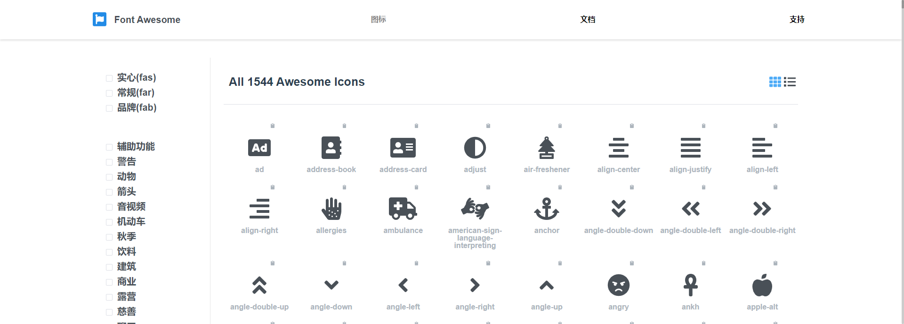

## Icon 图标
提供了一套非常丰富的图标集合，图标个数多达1544个。

### 一、图标集合
该组件基于`Font Awesome 5.x`进行封装，具体的图标集合请参见 [Font Awesome 5.x](https://fa5.dashgame.com/#/%E5%9B%BE%E6%A0%87)。


### 二、使用方法
通过设置`type`属性来设置图标。
:::demo 
```html
<template>
  <div class="ex-container">
    <s-icon type="address-book" />
    <s-icon type="address-card" />
    <s-icon type="adjust" />
    <s-icon type="air-freshener" />
  </div>
</template>
```
:::

:::tip
Icon 组件内部默认使用的图标样式前缀是 `fas`   

如果你需要使用其他样式前缀，比如 `far` 、`fab` 这样的样式前缀  

你需要使用 `custom` 属性手动指定样式，一个图标完整样式应该为 ： 前缀样式 + 以fa-为前缀的名称, 比如`custom="fab fa-vuejs"`。
:::

:::warning
使用 `type` 属性指定图标样式的时候，不需要加前缀样式和fa-。直接填写图标的样式名称即可。  

但是默认只支持 `fas` 前缀样式的图标。
:::

### 三、自定义图标样式
:::demo 使用 `custom` 属性自定义图标样式。

```html
<template>
    <s-icon custom="fab fa-angular" />
    <s-icon custom="fab fa-vuejs" />
    <s-icon custom="fab fa-react" />
    <s-icon custom="fab fa-node" />
</template>
```
:::

### 四、改变基本样式
通过`color`属性和`size`属性改变图标颜色和大小
:::demo `size`属性其实就是像素值，但是不可以加上`px`。
```html
<template>
<div class="ex-container">
  <s-icon type="address-book" color="#ede3e7"/>
  <s-icon type="address-card" color="#a61b29"/>
  <s-icon type="adjust" color="#2376b7" />
  <s-icon type="air-freshener" color="#440e25" />
</div>
<div class="ex-container">
  <s-icon type="address-book" size="36" />
  <s-icon type="address-card" size="30" />
  <s-icon type="adjust" size="24" />
  <s-icon type="air-freshener" size="18" />
</div>
</template>
```
:::

### 五、预定义大小
该组件中的图标提供了一些预定义尺寸，`sizetype`属性的值可以为`medium`、`small`、`mini`
:::demo 
```html
<template>
<div class="ex-container">
  <s-icon type="calendar-check" />
  <s-icon type="calendar-check" sizetype="medium"/>
  <s-icon type="calendar-check" sizetype="small" />
  <s-icon type="calendar-check"  sizetype="mini" />
</div>
</template>
```
:::

### 六、图标动画
提供了一些基本的动画效果供您使用，通过设置`spin`属性或者`pulse`属性可以使任意图标旋转
:::demo 
```html
<template>
<div class="ex-container">
  <s-icon type="address-book" color="#ede3e7" spin />
  <s-icon type="address-card" color="#a61b29" spin />
  <s-icon type="adjust" color="#2376b7" spin />
  <s-icon type="air-freshener" color="#440e25" spin />
</div>
<p></p>
<div class="ex-container">
  <s-icon type="spinner" spin />
  <s-icon type="circle-notch" spin />
  <s-icon type="sync" spin />
  <s-icon type="cog" spin />
</div>
<div class="ex-container">
  <s-icon type="spinner" pulse />
  <s-icon type="circle-notch" pulse />
  <s-icon type="sync" pulse />
  <s-icon type="cog" pulse />
</div>
</template>
```
:::

### Icon Attributes

| 参数          | 说明            | 类型            | 可选值                 | 默认值   |
|-------------  |---------------- |---------------- |---------------------- |-------- |
| type         | 图标类型   | string  |  | — |
| color | 图标颜色 | string  | — | — |
| sizetype     | 图标尺寸      | string          |  medium / small / mini  | default |
| size     |  图标大小  | number / string          | — | — |
| spin     |  图标旋转  | boolean         | — | false |
| pluse     |  图标卡点旋转  | boolean          | — | false |